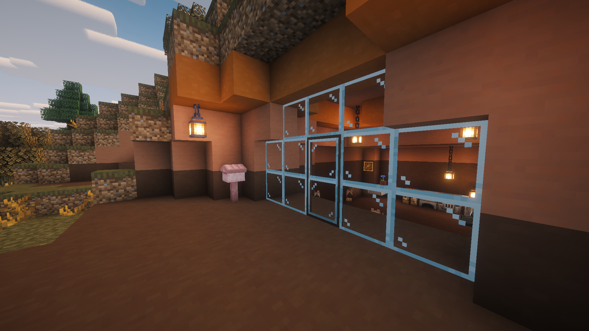

# Glass pane sliding door
A door that connects to glass panes leaving no gaps, sits in the center and ~~disappears~~ slides when opened. The door has collisions so you can sit on it and mobs larger than 0.99 of a block cannot pass through.

## Why
I built an house inside a mountain like most people do, noticed the beautiful view outside and decided to use glass to admire it, decided to use panes to make the room feal bigger and... realized that no door in minecraft sits in glass panes.

Thought it would be easier and take less to learn how to write a minecraft mod to have the door I needed than find a new idea for a home.
